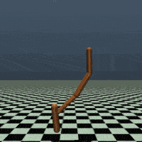

# RL: Sample-Efficient Sim-to-Sim Transfer for MuJoCo Hopper

This repository contains a reinforcement learning research project on robust locomotion transfer in a custom MuJoCo Hopper environment. The work studies how curriculum-based mass randomization and entropy control improve transfer performance when the evaluation robot differs from the training robot by a 30% torso-mass shift.

The project compares classical policy-gradient baselines with PPO-based transfer strategies and shows that PPO + Curriculum Domain Randomization (CDR) + Entropy Scheduling (ES) delivers the strongest combination of sample efficiency and robustness .



## Highlights

- Investigates sim-to-sim transfer under a controlled dynamics gap in MuJoCo Hopper.
- Benchmarks REINFORCE, REINFORCE with baseline, Actor-Critic, vanilla PPO, UDR, CDR, ES, UDR+ES, and CDR+ES.
- Uses a custom Hopper environment with domain-specific body-mass perturbations.
- Includes training scripts, evaluation scripts, stored experiment artifacts, result figures, and the final project report.

## Key Findings

- PPO + CDR + ES crosses the 5k-return mark in roughly `3.2e5` environment steps.
- Averaged across three seeds, PPO + CDR + ES improves cumulative return by `72%` relative to vanilla PPO.
- The same configuration achieves more than `4x` the cumulative return of PPO with uniform domain randomization.
- Classical policy-gradient baselines learn quickly at first but plateau well below the best PPO transfer variant.

## Repository Layout

```text
RL/
├── artifacts/
│   ├── logs/                 # Experiment CSV logs and evaluation outputs
│   └── models/               # Saved checkpoints and trained policies
├── docs/
│   ├── figures/              # Demo GIFs, plots, robustness curves, comparison charts
│   └── report/               # Final PDF report
├── src/
│   ├── agents/               # REINFORCE and Actor-Critic implementations
│   ├── env/                  # Custom MuJoCo Hopper environment
│   ├── evaluation/           # Evaluation, plotting, and visualization scripts
│   └── training/             # Training entry points and PPO sweep script
├── project_paths.py          # Centralized project path definitions
├── requirements.txt          # Minimal runtime dependencies
└── README.md
```

## Methods

### Environment Setup

- Source domain: Hopper with a 30% lighter torso mass.
- Target domain: evaluation under the original target dynamics.
- UDR: uniform mass randomization during training.
- CDR: progressively widened mass ranges during training.
- ES: entropy annealing to reduce exploration noise as training stabilizes.

### Algorithms

- `REINFORCE`
- `REINFORCE + baseline`
- `Actor-Critic`
- `PPO`
- `PPO + UDR`
- `PPO + CDR`
- `PPO + ES`
- `PPO + UDR + ES`
- `PPO + CDR + ES`

## Quick Start

### 1. Install dependencies

```bash
pip install -r requirements.txt
```

### 2. Install MuJoCo

This project depends on `mujoco-py` and a local MuJoCo 2.1 installation. Follow the official setup guide from the `mujoco-py` project for your operating system before running training or evaluation scripts.

### 3. Run training

```bash
# REINFORCE
python src/training/Train_Reinforce_Vanilla.py

# REINFORCE with baseline
python src/training/Train_Reinforce_Baseline.py

# Actor-Critic
python src/training/Train_Actor_Critic.py

# PPO + CDR + ES
python src/training/Train_PPO_UDR_ES_CDR.py --domain cdr --entropy-scheduling true --seed 0
```

### 4. Run evaluation

```bash
# PPO evaluation on the target domain
python src/evaluation/PPO_eval_model.py \
  --model_path artifacts/models/PPO/cdr_es/PPO_cdr_ES_True_seed_42_CustomHopper_cdr_v0_5000000.zip \
  --domain target \
  --entropy-scheduling true

# Observation-noise robustness curve
python src/evaluation/robustnesscurve_csv_extraction.py \
  --model-path artifacts/models/PPO/cdr_es/PPO_cdr_ES_True_seed_42_CustomHopper_cdr_v0_5000000.zip \
  --algorithm-label PPO_CDR_ES_seed_42 \
  --domain target

# Aggregate plots
python src/evaluation/learning_curve_plot_UDR.py
python src/evaluation/generate_auc_plots.py
```

### 5. Run the PPO hyperparameter sweep

```bash
python src/training/PPO_Hyperparameter_Calculation.py
```

The sweep writes the best PPO configuration to `artifacts/models/PPO/best_hyperparameters.json`.

## Documentation Map

- Main report: `docs/report/main_report.pdf`
- Demo GIF: `docs/figures/hopper_animation.gif`
- Summary comparison grid: `docs/figures/main_plot/all_metrics_grid.png`
- Learning curves: `docs/figures/ppo_learning_curves_source_target_gap_seeds_0_14_42.png`
- Robustness AUC comparison: `docs/figures/robustness_auc_comparison.png`
- Legacy exploratory plotting scripts kept for traceability: `src/evaluation/legacy_plotting/`

## What Is Included

- Reproducible training entry points for classical RL baselines and PPO variants.
- Stored checkpoints and experiment logs for representative runs.
- Figure assets ready for reports, presentations, and portfolio use.
- Final paper/report documenting motivation, methodology, experiments, and conclusions.

## Keywords

Reinforcement Learning, Proximal Policy Optimization, PPO, Sim-to-Sim Transfer, Sim-to-Real Motivation, Domain Randomization, Curriculum Learning, Entropy Scheduling, MuJoCo, Hopper, Robotics, Control, Policy Gradient, Transfer Learning, Robust RL

## Suggested GitHub Topics

`reinforcement-learning` `ppo` `mujoco` `domain-randomization` `curriculum-learning` `sim-to-real` `transfer-learning` `robotics`

## Hashtags

#ReinforcementLearning #PPO #MuJoCo #DomainRandomization #CurriculumLearning #EntropyScheduling #TransferLearning #Robotics #Sim2Real #Sim2Sim

## Team

- Ali Vaezi
- Yousef Fayyaz
- Sajjad Shahali Ramsheh
- Parastoo Hashemi Alvar
